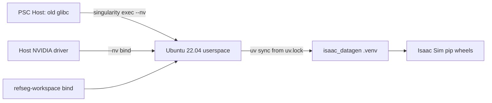

# PSC Singularity container for Isaac datagen

## Goal

Make `refseg-workspace/isaac_datagen` sync and run on PSC/Bridges-2 hosts whose native
glibc is too old for the Isaac Sim 5.1 pip wheels. The image supplies the system
userspace and native libraries; `uv.lock` remains the source of truth for Python
packages.

## Context

`uv sync` on PSC currently fails at `isaacsim==5.1.0.0` because the host presents a
`manylinux_2_28_x86_64` environment, while NVIDIA publishes Isaac Sim 5.1 Linux pip
wheels for `manylinux_2_35_x86_64` / glibc 2.35+. PSC's Singularity documentation says
containers must execute on Bridges-2 compute nodes, not front-end/login nodes. GPU
commands should run inside an allocated GPU node and pass host NVIDIA libraries through
with `singularity exec --nv`.

## Approach

1. Add `containers/isaac_datagen.def` based on `ubuntu:22.04` so the container provides
   glibc 2.35 and can install `isaacsim==5.1.0.0` wheels.
2. Install only system/runtime tools in the image:
   - `uv`
   - Python 3.11 support packages
   - compiler basics for native extensions
   - Git/Git LFS
   - OpenGL/EGL/Vulkan/X11/audio libraries used by Isaac/Omniverse
3. Keep Python dependencies out of the image by default. Users bind `refseg-workspace`
   and run `uv sync` inside the container, preserving per-project venv boundaries and
   avoiding a stale baked `.venv`.
4. Add `containers/README.md` with PSC-oriented build/run commands, cache bind
   recommendations, and smoke tests.
5. Optionally add a short pointer from `README.md` or the workspace README once the
   container recipe is verified.

## Proposed files

- `containers/isaac_datagen.def` — Singularity/Apptainer definition using
  `Bootstrap: docker`, `From: ubuntu:22.04`, installing system deps and `uv`.
- `containers/README.md` — build/run docs for PSC, including `singularity build`,
  `singularity exec --nv`, repo/cache binds, `uv sync`, and smoke tests.
- Optional: `README.md` or `refseg-workspace/README.md` pointer if this becomes the
  recommended PSC path for `isaac_datagen`.

## Container contract



## PSC workflow

PSC documents that containers execute on Bridges-2 compute nodes, not front-end nodes.
For interactive GPU validation:

```bash
interact --gpu
```

Then run inside the allocated GPU node:

```bash
singularity exec --nv \
  --bind /ocean/projects/cis260205p/jke2/refseg-workspace:/workspace \
  --bind /ocean/projects/cis260205p/jke2:/scratch/$USER \
  isaac_datagen.sif \
  bash -lc 'cd /workspace/isaac_datagen && uv sync'
```

Prefer `singularity` in PSC docs and examples. Mention `apptainer` only as the modern
equivalent for systems where that command is installed.

## Validation steps

1. Build image on PSC or a compatible builder:

   ```bash
   singularity build isaac_datagen.sif containers/isaac_datagen.def
   ```

2. Confirm userspace compatibility:

   ```bash
   singularity exec isaac_datagen.sif bash -lc 'ldd --version | head -1'
   ```

3. Confirm GPU passthrough on a GPU compute node:

   ```bash
   singularity exec --nv isaac_datagen.sif nvidia-smi
   ```

4. Sync inside the container:

   ```bash
   singularity exec --nv \
     --bind /ocean/projects/cis260205p/jke2/refseg-workspace:/workspace \
     --bind /ocean/projects/cis260205p/jke2:/scratch/$USER \
     isaac_datagen.sif \
     bash -lc 'cd /workspace/isaac_datagen && uv sync'
   ```

5. Run a minimal Isaac import/boot smoke test on an interactive GPU node:

   ```bash
   singularity exec --nv \
     --bind /ocean/projects/cis260205p/jke2/refseg-workspace:/workspace \
     isaac_datagen.sif \
     bash -lc 'cd /workspace/isaac_datagen && uv run python -c "import isaacsim"'
   ```

6. If import succeeds, run one tiny `isaac_datagen` command that exercises the intended
   path before attempting a full render.

## Design review

- Keep mechanism separate from policy: the container owns system ABI/native library
  compatibility; `uv.lock` owns Python resolution.
- Minimize surface area: one definition file plus docs; no custom install scripts unless
  repeated commands become painful.
- Compose existing tools: Singularity handles host GPU binding, Ubuntu supplies system
  libraries, uv installs the locked Python environment. Avoid vendoring Isaac or
  hand-managing Python packages.

## Checklist

- [ ] Add `containers/isaac_datagen.def` with Ubuntu 22.04 base, system libraries,
      Python 3.11 tooling, Git/Git LFS, and uv.
- [ ] Add `containers/README.md` documenting PSC build/run commands, bind mounts,
      cache directories, and expected limitations.
- [ ] Validate `ldd --version`, `uv sync`, `import isaacsim`, and one minimal datagen
      command inside `singularity exec --nv`.
- [ ] Add a short README pointer if the container becomes the recommended PSC path for
      `isaac_datagen`.
