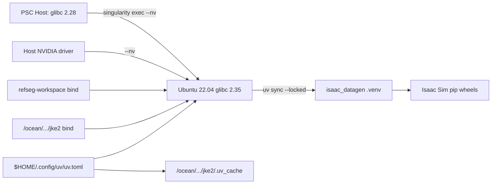

# PSC Singularity container for Isaac datagen

**Status: completed 2026-06-19.**

## Goal

Make `refseg-workspace/isaac_datagen` sync and run on PSC/Bridges-2 hosts whose native
glibc is too old for the Isaac Sim 5.1 pip wheels. The image supplies the system
userspace and native libraries; `uv.lock` remains the source of truth for Python
packages.

## Context

`uv sync` on PSC fails at `isaacsim==5.1.0.0` because the host presents a
`manylinux_2_28_x86_64` environment, while NVIDIA publishes Isaac Sim 5.1 Linux pip
wheels for `manylinux_2_35_x86_64` / glibc 2.35+. Containers must run on Bridges-2
compute nodes (not login nodes). GPU commands use `singularity exec --nv`.

## What was built

- `containers/isaac_datagen.def` — Ubuntu 22.04 userspace + `uv` + system libs; sets
  `OMNI_KIT_ACCEPT_EULA=YES` and `UV_LINK_MODE=copy`.
- `containers/isaac_datagen.sif` — built image (~263 MB SquashFS on ocean).
- `containers/README.md` — detailed PSC build/run reference.
- `README.md` — concise container quick-start.
- `clean_datagen.py` — sets `OMNI_KIT_ACCEPT_EULA=YES` before sim boot.

Python packages are **not** baked in. Bind `refseg-workspace` and run `uv sync --locked`.

## Container contract

## Validation (done)

- [x] `ldd --version` → glibc 2.35 inside container
- [x] `nvidia-smi` with `--nv` on GPU node
- [x] `uv cache dir` → `/ocean/projects/cis260205p/jke2/.uv_cache` (via user `uv.toml`)
- [x] `uv sync --locked` inside container (~19 min, 176 packages)
- [x] `import isaacsim` with `OMNI_KIT_ACCEPT_EULA=YES`

## Checklist

- [x] Add `containers/isaac_datagen.def`
- [x] Add `containers/README.md`
- [x] Validate glibc, GPU, `uv sync --locked`, `import isaacsim`
- [x] Add README pointer

## Design notes

- Container owns system ABI; `uv.lock` owns Python resolution.
- uv cache on ocean via `$HOME/.config/uv/uv.toml` — never `$HOME/.cache/uv`.
- Bind `$OCEAN_ROOT` at the same absolute path so cache-dir resolves in-container.
- Do not run `uv lock` on native PSC glibc 2.28 host.
