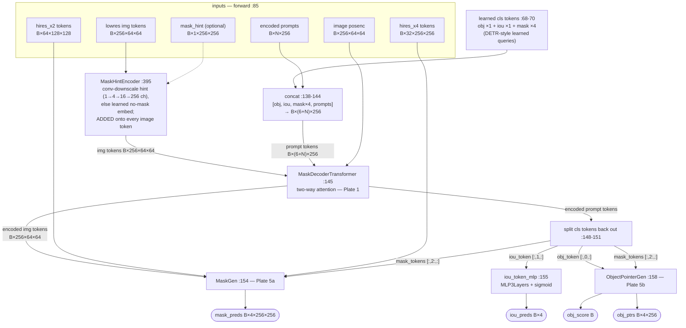
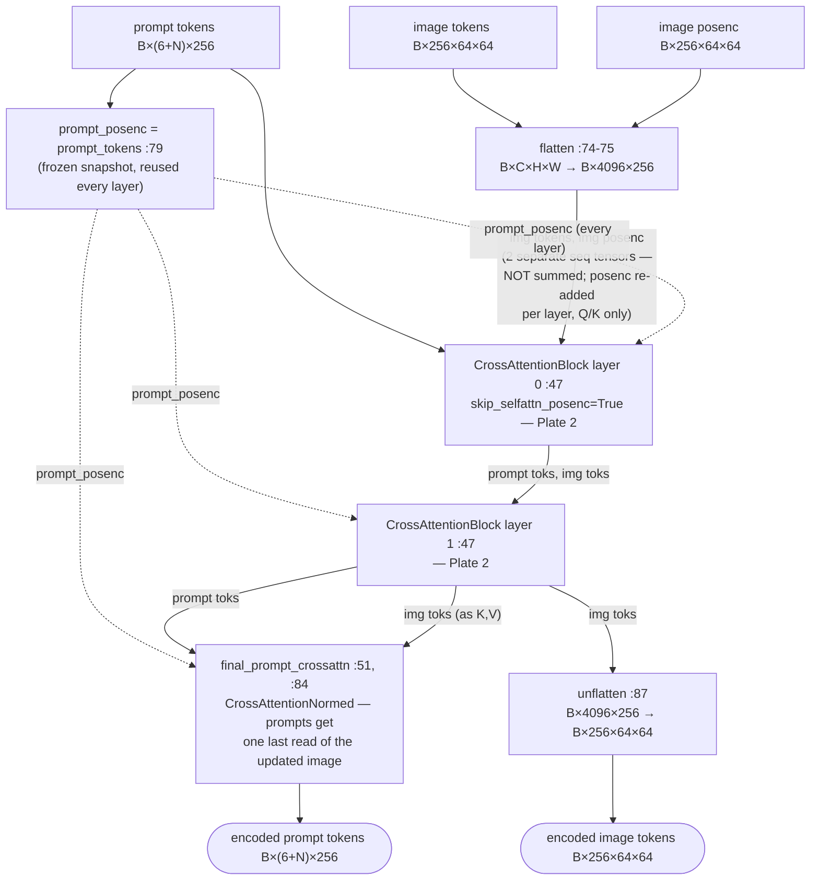
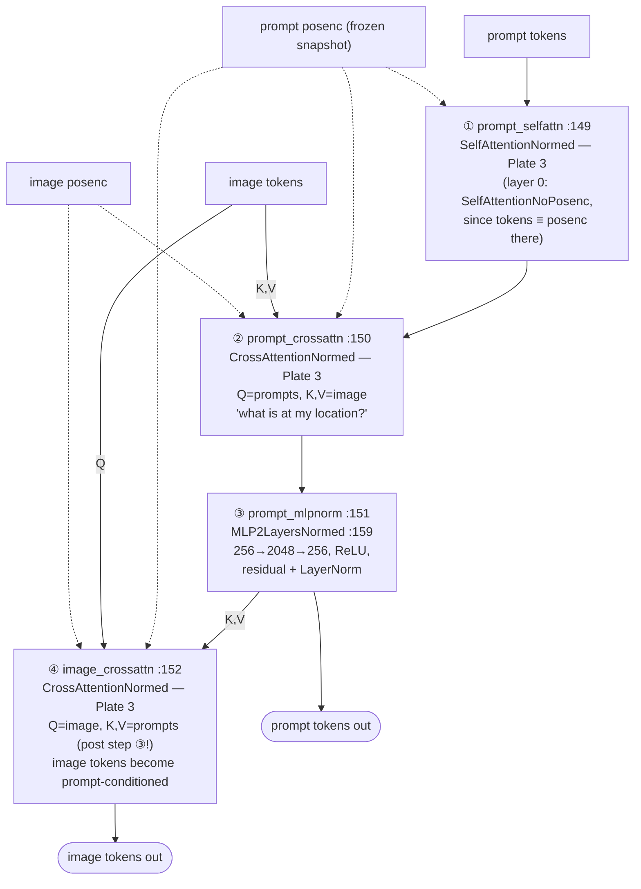
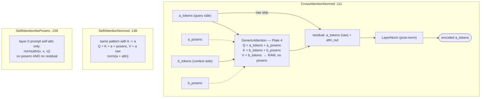
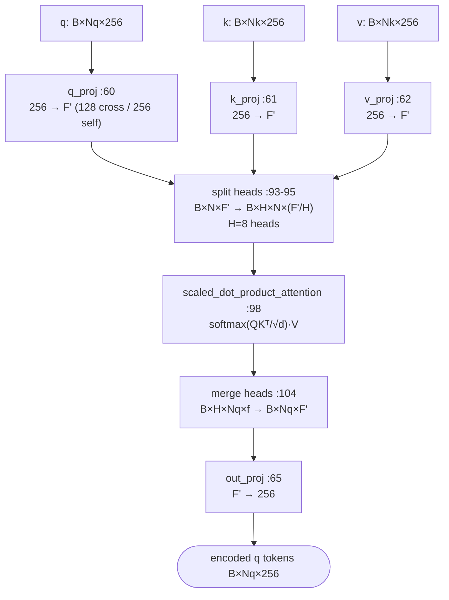
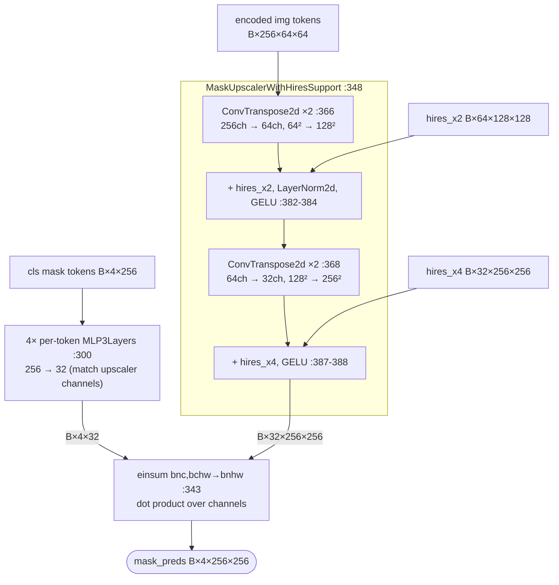
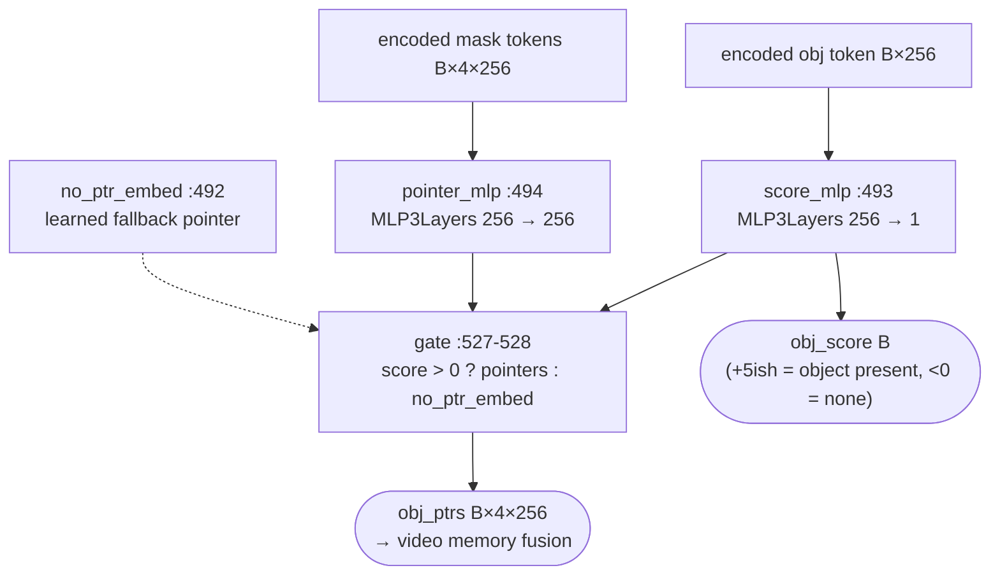

# SAMv2 Mask Decoder — Atlas

Multi-level map of `SAMV2MaskDecoder` from the muggled_sam repo
(`/home/jeffk/repo/muggled_sam/muggled_sam/v2_sam/`).
Each plate expands one node from the plate above. Solid edges = tensor flow,
dotted = optional input, line refs point into the source files.

| Plate | Class | File |
|---|---|---|
| 0 | `SAMV2MaskDecoder` | `mask_decoder_model.py:21` |
| 1 | `MaskDecoderTransformer` (TwoWayTransformer) | `components/mask_decoder_transformer.py:20` |
| 2 | `CrossAttentionBlock` (TwoWayAttentionBlock) | `components/mask_decoder_transformer.py:94` |
| 3 | Attention wrappers (`CrossAttentionNormed` / `SelfAttentionNormed` / `SelfAttentionNoPosenc`) | `components/mask_decoder_attention.py:111-159` |
| 4 | `GenericAttention` | `components/mask_decoder_attention.py:19` |
| 5a | `MaskGen` + `MaskUpscalerWithHiresSupport` | `mask_decoder_model.py:272, 348` |
| 5b | `ObjectPointerGen` | `mask_decoder_model.py:475` |

---

## Plate 0 — `SAMV2MaskDecoder` (mask_decoder_model.py:21)

The big idea: each output head owns a **learned query token** (DETR-style) that rides
through the transformer alongside the prompt tokens. The transformer charges those
tokens with content; the heads just decode them.

V2-vs-V1 deltas visible at this level: the obj token / `ObjectPointerGen` (video
memory) and the hires_x2/x4 skip inputs into `MaskGen` (hierarchical Hiera encoder).

---

## Plate 1 — `MaskDecoderTransformer` (mask_decoder_transformer.py:20)

The "TwoWayTransformer": depth=2 blocks + one final prompt→image cross-attention.

Two design moves live here:
- image tokens are flattened to a sequence at entry, restored at exit (:74, :87)
- **prompt tokens are their own positional encoding** (:79): captured once, frozen,
  re-injected at *every* attention layer — the prompts' identity never washes out.

---

## Plate 2 — `CrossAttentionBlock` (mask_decoder_transformer.py:94)

One "two-way" block = 4 strictly sequential ops (:149-152). Steps 1–3 update the
prompt side; step 4 flips the roles so the **image** queries the prompts — image
tokens leave having attended to the prompt, their embeddings now prompt-conditioned,
which is what makes the dot-product readout in MaskGen work. (Without this step the
readout would be a linear probe over a fixed, prompt-agnostic feature field —
unable to separate identical-looking instances.)

---

## Plate 3 — Attention wrappers (mask_decoder_attention.py:111-159)

The most distinctive design decision in the module. All wrappers share one pattern:

- **posenc goes into Q and K only, never V** — position decides *who attends to whom*;
  the content that flows is position-free. Re-added fresh at every layer.
- **post-norm residual** taken from the *raw* (pre-posenc) tokens:
  `norm(a_tokens + attn_result)` — unlike the pre-norm ViT convention.

---

## Plate 4 — `GenericAttention` (mask_decoder_attention.py:19)

Vanilla multi-head attention with one twist: an **internal feature bottleneck**.
Cross-attention layers run at `internal_features = downsample_dim = 128` (half the
256-d token width) because they span 4096 image tokens; self-attention layers run
full-width 256 since they only span ~10 prompt tokens. Bottleneck applied exactly
where the token count is large.

---

## Plate 5a — `MaskGen` (mask_decoder_model.py:272) + upscaler (:348)

The readout is a **dot product**: each mask token becomes a dynamic 1×1-conv filter
applied to the upscaled image tokens — `einsum("bnc,bchw->bnhw")` (:343).
The upscaler is where the V2 hires skip connections land.

---

## Plate 5b — `ObjectPointerGen` (mask_decoder_model.py:475) — V2 only

Object score (is anything masked?) from the obj token; per-mask pointers (video
memory representation) from the mask tokens, gated by the score.

---

## TL;DR

Two (+1 final) asymmetric two-way blocks where prompts self-attend, then prompts
and image cross-attend in *both directions* alternately; posenc is Q/K-only and
re-injected every layer (prompts acting as their own posenc); cross-attention is
bottlenecked to 128-d for the 4096-token image side; and the whole transformer
exists to charge up 6 learned cls tokens whose dot products / MLP decodings *are*
the outputs.
